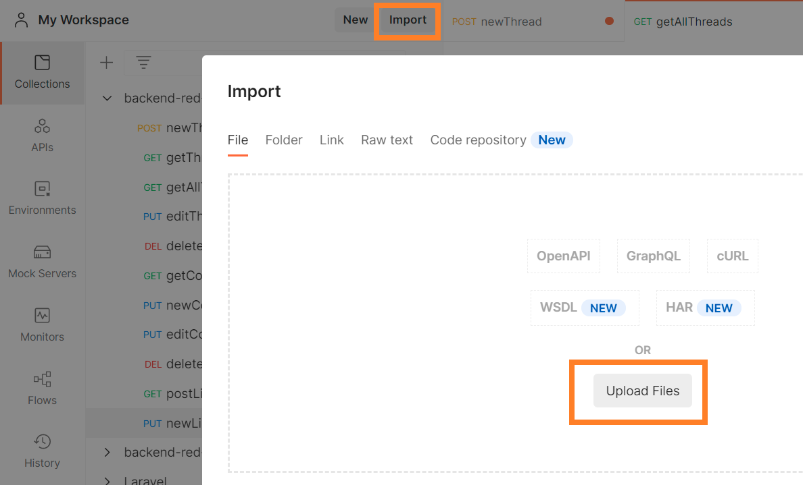
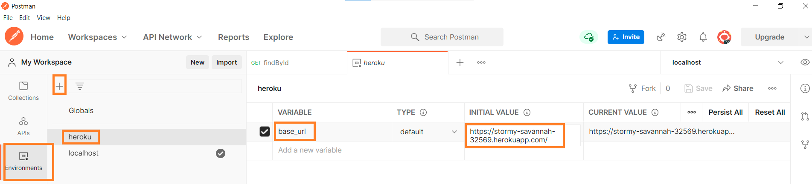
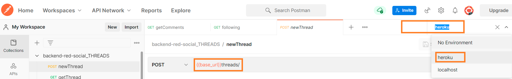

# Backend Red Social Foro Food

[Foro Food - Enlace para visitar el proyecto finalizado](https://main.d3dvg1o4r0h473.amplifyapp.com/)

- Este proyecto se ha realizado durante la formación Full Stack Devoper de [GeeksHubs Academy](https://geekshubs.com/academy/coding-school/)
- Consiste en la realización de un BackEnd para nuestra aplicación SPA realizada con React:
  - [Foro Food - Enlace al repositorio](https://github.com/angelgr-com/frontend-red-social) 

- La base de datos se ha implementado con [MongoDB](https://www.mongodb.com/) y se modifica empleando el ORM [Mongoose](https://mongoosejs.com/). Los ficheros de la base de datos están alojados en [Atlas](https://www.mongodb.com/atlas/database).

-----------------------------------------------------------------------------------------------------------------------------------------------------

## Tabla de contenidos

[TOC]

## Tecnologías utilizadas 🚀

El proyecto ha sido desarrollado utilizando los siguientes paquetes en Nodejs:

- Axios (0.26.1)
- Bcryptjs (5.0.1)
- Cors (2.8.5)
- Dotenv (16.0.0)
- Express (4.17.3)
- Jsonwebtoken (8.5.1)
- Mongoose (6.2.8)
- Nodemon (2.0.15)

-----------------------------------------------------------------------------------------------------------------------------------------------------

### ¿Cómo desplegar el proyecto? 

Las siguientes instrucciones permiten obtener una copia local del proyecto para investigación de código o de desarollo:

- Para clonar el repositorio localmente usar el comando:

  ```
  https://github.com/angelgr-com/backend-red-social
  ```

- Para instalar las dependencias necesarias usar el comando:

  ```
  npm i
  ```

- Se han empleado las siguientes variables de entorno en un fichero .env en la raíz del proyecto:

  ```
  MONGODB_URI=""
  AUTH_SECRET=""
  AUTH_EXPIRES="" 
  AUTH_ROUNDS=""
  ```

...ya está listo el back-end de **FORO FOOD!**

-----------------------------------------------------------------------------------------------------------------------------------------------------

## Modelo de la base de datos 🔧

La base de datos emplea dos esquemas para almacenar la información de la aplicación. El modelo de datos de cada uno:

- User

  ```js
  const userSchema = new Schema ({
      name: {
          type: String,
          required: true
      },
      nickname: {
          type: String,
          unique: true,
          required: true
      },
      email: {
          type: String,
          required: true,
          unique: true,
          lowercase: true
      },
      password: {
          type: String,
          required: true
      },
      avatar: {
          type: String,
          required: false
      },
      following: [{ type: String }],
      followers: [{ type: String }],
      isAdmin: {
          type: Boolean,
          default: false
      }
  });
  ```

- Threads

  ```javascript
  const threadSchema = new Schema({
      title: {
          type: String,
      },
      title_url: {
          type: String,
      },
      theme: {
          type: String,
      },
      posts: [{
          author: {
              type: String,
          },
          date: {
              type: Date,
              default: Date.now
          },
          content: {
              type: String,
          },
          likes: {
              type: Number,
              default: 0
          },
          dislikes: {
              type: Number,
              default: 0
          },
      }]
  });
  ```

-----------------------------------------------------------------------------------------------------------------------------------------------------

## Funcionalidad de la APP 🛠️

El sistema puede realizar las siguientes acciones:

- CRUD Hilos.
- CRUD Comentarios.
- CRUD Usuarios.
- Encriptación de campos mediante Bcryptjs.
- Proceso de autenticación mediante jsonwebtoken.
- El sistema permite administrar a los usuarios por roles.
- Registro mediante formulario.
- Acceso mediante formulario.

-----------------------------------------------------------------------------------------------------------------------------------------------------

## Funcionalidad de los endpoints 🛠️

### Configuración Postman

En la raíz del proyecto, se encuentran dos ficheros .json que contienen los endpoints empleados en **Postman**:

- **backend-red-social_THREADS.postman_collection.json**
- **Pasos para emplear los ficheros en **Postman**:

- **Importar **los dos ficheros como se indica en la siguiente imagen:



- Seleccionar **environments **(tercera opción de la columna de la izquierda):

  - Pulsar en el símbolo más para crear un nuevo entorno global (con nombre, por ejemplo, **heroku**)
  - Guardar una nueva variable con nombre **base_url**
  - En **INITIAL VALUE** darle el valor https://stormy-savannah-32569.herokuapp.com/

  

- Finalmente, seleccionar el entorno creado (heroku) para que el programa interprete correctamente la variable de los endpoints. Es útil para alternar fácilmente entre localhost y el entorno de producción.

  

### Endpoints

El sistema puede realizar las siguientes acciones:

- **THREADS**

  - POST newThread

    ```
    /threads/
    ```

    ```js
    router.post("/", auth, ThreadsController.newThread);
    ```

    ```json
    {
        "title": "nuevo hilo",
        "theme": "española",
        "posts": [
            {
                "author": "angel",
                "content": "Comentario inicial que abre el hilo"
            }
        ]
    }
    ```

  - GET getThread

    ```
    /threads/:title
    ```

    ```js
    router.get("/:title", auth, ThreadsController.getThread);
    ```

  - GET getAllThreads

    ```
    /threads/
    ```

    ```js
    router.get("/", auth, isAdmin, ThreadsController.getAllThreads);
    ```

  - GET threadsByTheme

    ```
    /threads/theme/:theme
    ```

    ```js
    router.get("/theme/:theme", auth, ThreadsController.getThreadsByTheme);
    ```

  - PUT editThread

    ```
    /threads/:title
    ```

    ```js
    router.put("/:title", auth, ThreadsController.editThread);
    ```

    ```json
    {
        "title": "cambiar-titulo"
    }
    ```

  - DEL deleteThread

    ```
    /threads/:id
    ```

    ```js
    router.delete("/:id", auth, ThreadsController.deleteThread);
    ```

  - GET getComments

    ```
    /threads/comments/all/:title
    ```

    ```js
    router.get("/comments/all/:title", auth, ThreadsController.getComments);
    ```

  - PUT newComment

    ```
    /threads/comments/new/:title
    ```

    ```js
    router.put("/comments/new/:title", auth, ThreadsController.newComment);
    ```

    ```json
    {
        "posts": [
            {
                "author": "angel",
                "content": "otro comentario nuevo"
            }
        ]
    }
    ```

  - PUT editComment

    ```
    /threads/comments/edit/:id/:title
    ```

    ```js
    router.put("/comments/edit/:id/:title", auth, ThreadsController.editComment);
    ```

    ```json
    
    ```

  - DEL deleteComment

    ```
    /threads/
    ```

    ```js
    router.delete("/comments/delete/:id/:title", auth, ThreadsController.deleteComment)
    ```

    ```json
    {
        "content": "Comentario nuevo editado"
    }
    ```

  - GET likesFromComments

    ```
    /threads/
    ```

    ```js
    router.get("/likes/:index/:title", auth, ThreadsController.likesFromComment);
    ```

  - GET newLike

    ```
    /threads/
    ```

    ```js
    router.get("/likes/:id/:title/", auth, ThreadsController.newLike);
    ```

- **USERS**

  - POST register

    ```
    /users/register
    ```

    ```js
    router.post("/register", UsersController.register);
    ```

    ```json
    {
        "name": "Anibal",
        "nickname": "anibal",
        "email": "anibal@gmail.com",
        "password": "1234",
        "avatar": "",
        "isAdmin": false
    }
    ```

  - POST login

    ```
    /users/login
    ```

    ```js
    router.post("/login", UsersController.login);
    ```

    ```json
    {
        "email": "anibal@gmail.com",
        "password": "1234"
    }
    ```

  - GET find

    ```
    /users/:id
    ```

    ```js
    router.get("/:id", auth, UsersController.find);
    ```

  - PUT update

    ```
    /users/:id
    ```

    ```js
    router.put("/:id", auth, UsersController.update);
    ```

    ```json
    {
        "name": "Anibal",
        "nickname": "anibal",
        "email": "anibal@outlook.com",
        "password": "1234",
        "avatar": "",
        "isAdmin": true
    }
    ```

  - DEL delete

    ```
    /users/:id
    ```

    ```js
    router.delete("/:id", auth, isAdmin, UsersController.delete);
    ```

  - PUT userFollows

    ```
    /users/:user/follows/:nickname
    ```

    ```js
    router.put("/:user/follows/:nickname", auth, UsersController.userFollows);
    ```

  - PUT addFollower

    ```
    /users/:nickname/add-follower/:user
    ```

    ```js
    router.put("/:nickname/add-follower/:user", auth, UsersController.addFollower);
    ```

  - GET following

    ```
    /users/following/:id
    ```

    ```js
    router.get("/following/:id", UsersController.following);
    ```

  - GET followers

    ```
    /users/followers/:nickname
    ```

    ```js
    router.get("/followers/:nickname", auth, UsersController.followers);
    ```

    

-----------------------------------------------------------------------------------------------------------------------------------------------------

## Autores ✒️

Angel Garrigues  https://github.com/angelgr-com/

Rafa Orti https://github.com/RafaelOrti

Rodrigo Campos https://github.com/RCD1985-GT